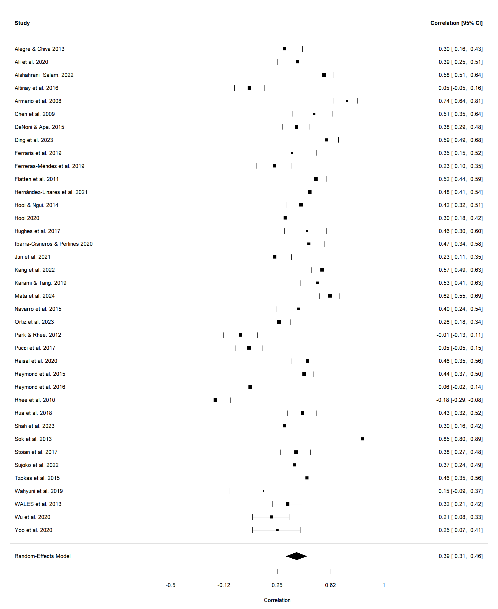
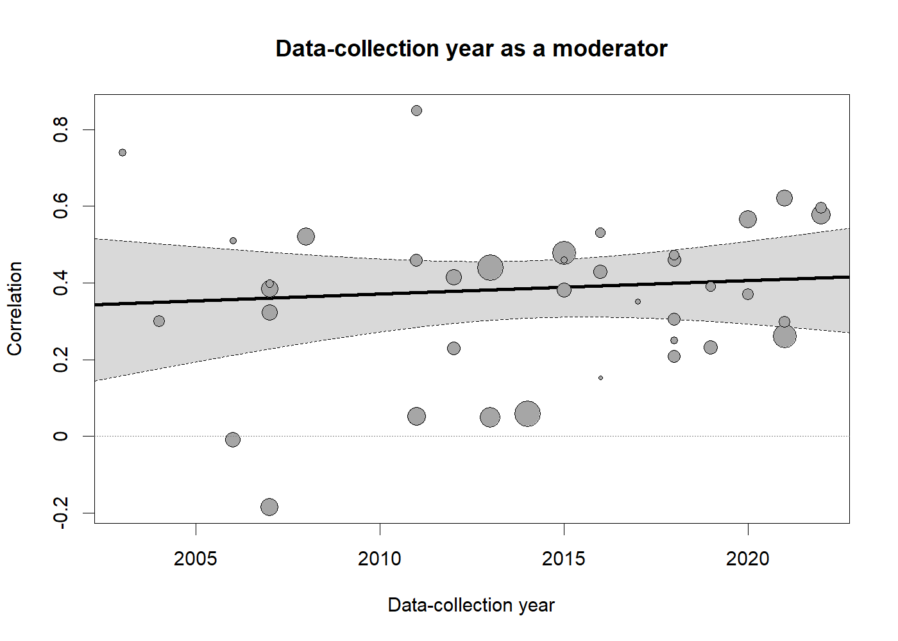
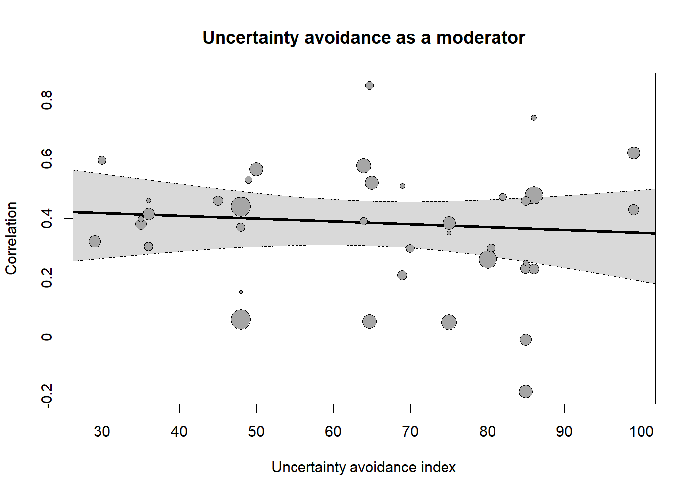
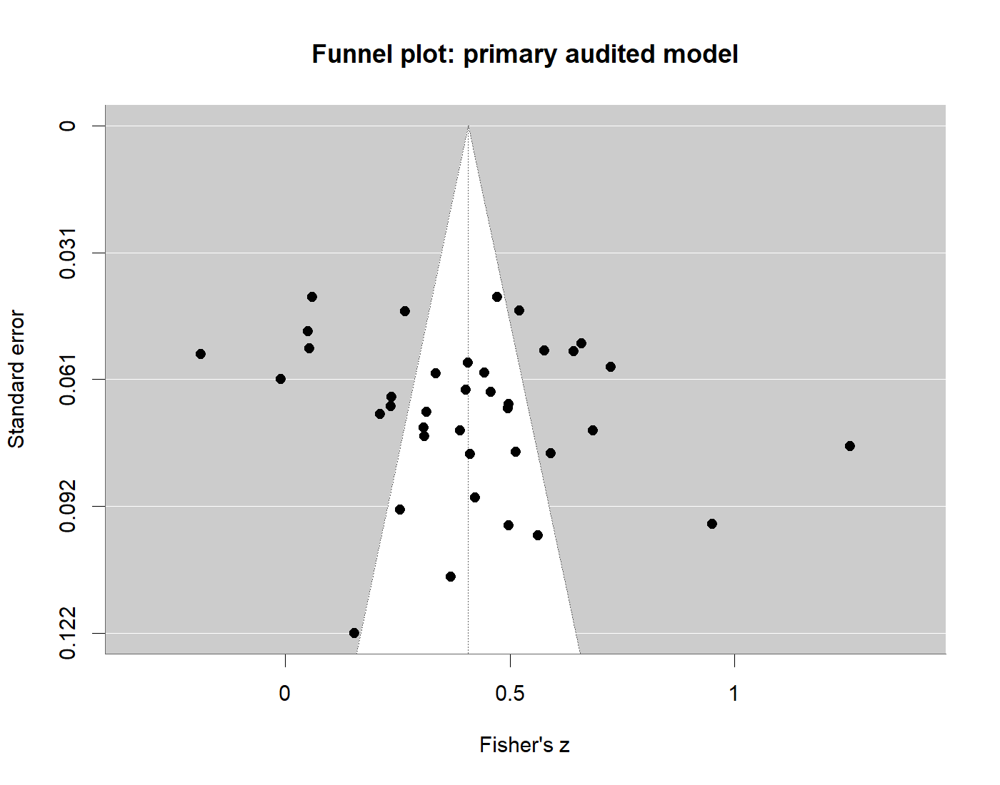
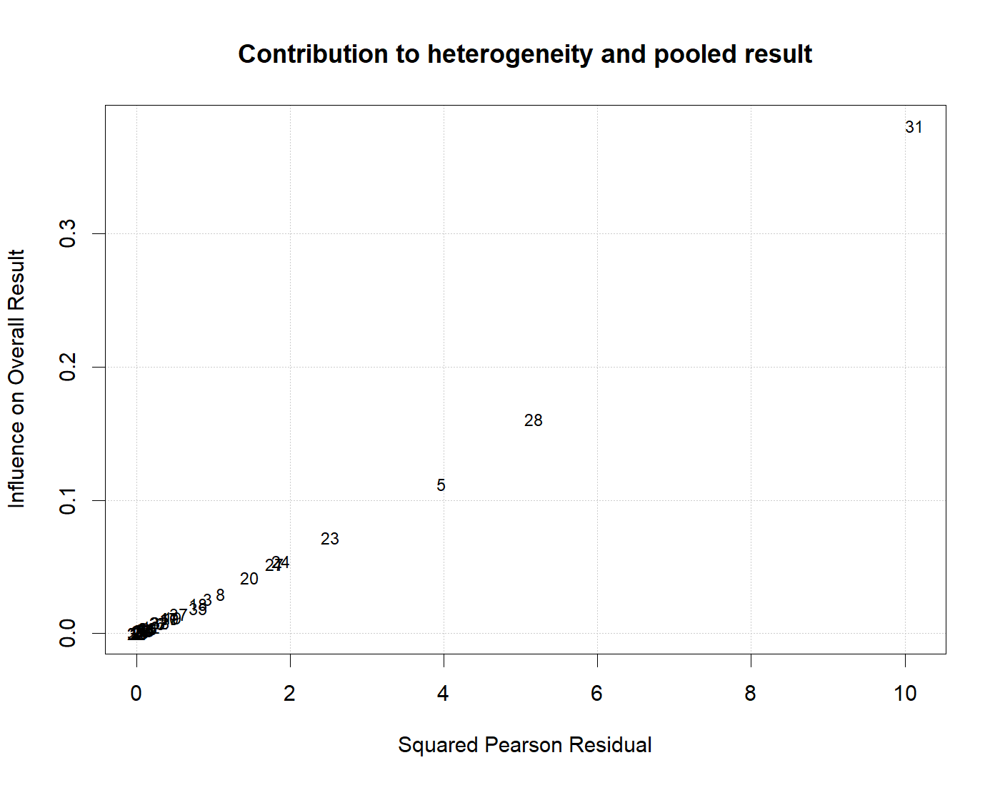

# Absorptive Capacity and SME Performance Meta-Analysis

This project reproduces and audits a meta-analysis of the association between absorptive capacity (ACAP) and SME business performance. It contains 70 screened articles and 39 studies selected for the submitted analysis, with a combined sample of 10,011 observations.

The original Excel workbook and presentation are preserved unchanged in [`archive/original-project`](archive/original-project). The R pipeline reads the archived workbook, verifies its reliability-correction formula, constructs explicit audit flags, reproduces the submitted Meta-Essentials results, and runs a more defensible set of random-effects analyses.

## Main conclusion

The submitted pooled association is reproducible: the observed-effects estimate is **r = 0.39, 95% CI [0.31, 0.46]**. Correcting the individual effects for measurement reliability raises it to **r = 0.47, 95% CI [0.37, 0.55]**.

The evidence supports a positive average association, but the magnitude is not stable across studies. In the primary audited model, **I² = 94.27%** and the **95% prediction interval is [-0.12, 0.73]**. A future comparable study could therefore plausibly find a negligible, negative, or large positive association. The pooled mean should not be described as a universal effect.

The original claims that the relationship increases over time and weakens under greater uncertainty avoidance do not survive random-effects meta-regression. Both audited moderator tests have **p ≈ 0.61**.

## Submitted-result replication

The benchmark calculation follows the approach used by ERIM's Meta-Essentials Workbook 5:

1. Transform each correlation with Fisher's `z = atanh(r)`.
2. Use sampling variance `v = 1 / (n - 3)`.
3. Estimate between-study variance with the DerSimonian-Laird method.
4. Pool effects with inverse-variance random-effects weights.
5. Apply the Meta-Essentials weighted-variance confidence interval and transform results back to correlations.

| Analysis | k | Pooled r | 95% CI | 95% prediction interval | I² |
|---|---:|---:|---:|---:|---:|
| Observed effects | 39 | 0.385 | [0.311, 0.455] | [-0.108, 0.726] | 94.06% |
| Reliability-corrected effects | 39 | 0.465 | [0.374, 0.547] | [-0.157, 0.823] | 96.32% |

The reliability correction in the Excel workbook is reproduced exactly:

```text
corrected effect = observed effect / sqrt(ACAP reliability × performance reliability)
```

For the corrected effects, R reproduces the presentation's **Q = 1033.33**, **df = 38**, and **I² = 96.32%**.

## Audited random-effects results

The primary audited model removes the one study whose missing outcome was replaced with the grand mean. It uses REML estimation and Knapp-Hartung inference.

| Analysis | k | Pooled r | 95% CI | 95% prediction interval | I² |
|---|---:|---:|---:|---:|---:|
| Primary: remove mean-imputed outcome | 38 | 0.386 | [0.310, 0.458] | [-0.117, 0.731] | 94.27% |
| Also remove documented `+0.05` adjustments | 28 | 0.373 | [0.272, 0.466] | [-0.194, 0.753] | 95.35% |
| Clearly documented correlations only | 13 | 0.211 | [0.080, 0.335] | [-0.258, 0.600] | 92.55% |
| Reliability correction where both reliabilities were reported | 32 | 0.500 | [0.401, 0.587] | [-0.147, 0.847] | 96.20% |

The average association remains positive across these models, but its estimated magnitude depends strongly on which effect-size definitions are accepted. The correlation-only result is substantially smaller than the submitted result. This sensitivity confirms that correlations and regression/path coefficients should not be pooled without recoding the original studies.



## Moderator analyses

The submitted moderator results can be reproduced only with fixed-effect inverse-variance weighted regressions on the uncorrected effects.

| Moderator | Submitted method | Submitted result | Audited REML result | Audited p-value |
|---|---|---:|---:|---:|
| Data-collection year | Fixed effect | standardized β = 0.225, Z = 5.70 | slope = 0.0041 Fisher-z units/year, t = 0.52 | 0.609 |
| Uncertainty avoidance | Fixed effect | standardized β = -0.091, Z = -2.30 | slope = -0.0011 Fisher-z units/point, t = -0.52 | 0.607 |

Once residual between-study heterogeneity is acknowledged, neither moderator provides reliable evidence of an association. The submitted hypothesis-support decisions for time and uncertainty avoidance are therefore not retained.





## Region and industry

The audited omnibus tests do not detect subgroup differences:

| Moderator | Test | Degrees of freedom | p-value |
|---|---:|---:|---:|
| Continent | 0.408 | 4 and 33 | 0.802 |
| Industry | 1.440 | 2 and 35 | 0.251 |

The continent comparison is underpowered. After the mean-imputed study is removed, the grouped `Other` category contains only one study. North America contains three studies and Australia contains two. The absence of statistical significance should not be interpreted as evidence that all regions have the same effect.

Industry estimates also have unequal precision. The primary dataset contains 21 manufacturing studies, 13 mixed-industry studies, and only 4 service studies. The pooled service estimate is about **r = 0.20**, versus approximately **r = 0.41** for manufacturing and mixed samples, but the service confidence interval is very wide. The original presentation reversed the labels for the mixed and service categories in its industry plot.

Full estimates and intervals are in [`outputs/tables/subgroup_results.csv`](outputs/tables/subgroup_results.csv).

## Publication bias and influence diagnostics

In the audited primary model:

- Egger's regression is not statistically significant: **z = 1.16, p = 0.255**.
- R's trim-and-fill procedure imputes **zero studies**. This differs from the submitted slide, which reports one imputed study under its original settings.
- These procedures remain exploratory because heterogeneity is extreme and can itself produce funnel-plot asymmetry.
- `Sok et al. 2013` is flagged as influential. Removing one study at a time changes the pooled estimate only from **r = 0.366 to r = 0.400**, so no single study explains the positive pooled association.





## Data-quality audit

The R preparation step preserves the submitted values and adds explicit flags. It does not silently repair ambiguous evidence.

| Finding | Count |
|---|---:|
| Selected studies | 39 |
| Grand-mean-imputed outcomes | 1 |
| Documented `+0.05` adjustments | 10 |
| Clearly documented correlations or means of correlations | 13 |
| Regression/path-coefficient descriptions | 17 |
| Unclear effect provenance | 9 |
| Imputed ACAP reliabilities | 3 |
| Imputed performance reliabilities | 5 |
| Imputed firm ages | 20 |
| Imputed numeric firm sizes | 17 |

The principal limitations are:

- The effect-size column mixes zero-order correlations, regression coefficients, path coefficients, indirect effects, and averages of multiple coefficients.
- Ten coding comments document adding `0.05` to a reported coefficient. No accepted statistical transformation justifies this rule.
- One study with no direct effect was assigned the grand-mean effect and included in the submitted model.
- Reliability correction partly relies on mean-imputed reliability values and systematically increases absolute effect sizes.
- Mean-imputed moderator values reduce observed variation and can distort moderator standard errors.
- The workbook has one row per study, so the current analysis avoids within-study dependence, but some rows average subdimensions or outcomes without preserving their covariance.

The conservative correlation-only sensitivity is based on textual provenance in the workbook. A publication-quality update should return to every original paper and record a comparable zero-order, partial, or semi-partial correlation with an explicit extraction rule.

## Project structure

```text
.
├── R/
│   ├── 01_prepare_data.R       # import, validation, provenance and audit flags
│   ├── 02_analysis.R           # benchmark, audited, subgroup and bias models
│   └── 03_outputs.R            # tables, figures and session information
├── archive/original-project/   # unchanged Excel workbook and PowerPoint
├── data/processed/             # generated analysis-ready CSV
├── outputs/figures/            # forest, funnel, moderator and influence plots
├── outputs/tables/             # complete numerical results and diagnostics
├── renv.lock                   # pinned R dependencies
├── run_analysis.R              # one-command pipeline entry point
└── README.md                   # methods and results report
```

## Reproduce the analysis

Open a terminal in the project directory and run:

```powershell
& "C:\Program Files\R\R-4.4.2\bin\Rscript.exe" -e "renv::restore()"
& "C:\Program Files\R\R-4.4.2\bin\Rscript.exe" run_analysis.R
```

The second command regenerates the processed dataset, tables, figures, and `outputs/session-info.txt`. The scripts stop if the reliability correction differs from Excel or if correlations/sample sizes are invalid.

## Methodological references

- Suurmond, R., van Rhee, H., & Hak, T. (2017). Introduction, comparison and validation of Meta-Essentials: A free and simple tool for meta-analysis. *Research Synthesis Methods, 8*(4), 537–553. https://doi.org/10.1002/jrsm.1260
- ERIM Meta-Essentials downloads and version history: https://www.eur.nl/en/erim/research-support/meta-essentials/download
- ERIM Meta-Essentials user manual: https://www.eur.nl/en/erim/media/2025-07-user-manual-15
- Viechtbauer, W. (2010). Conducting meta-analyses in R with the metafor package. *Journal of Statistical Software, 36*(3), 1–48. https://doi.org/10.18637/jss.v036.i03

## Interpretation boundary

These results summarize associations reported across the coded studies. They do not establish that increasing absorptive capacity causes improved SME performance. Strong heterogeneity, mixed effect definitions, and several undocumented transformations limit causal and contextual conclusions.

